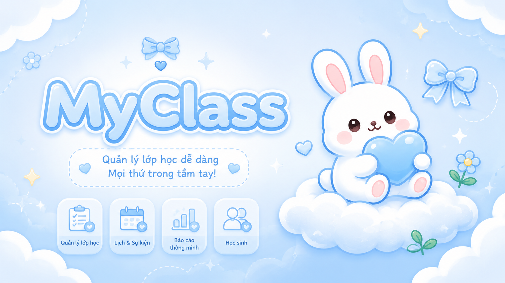

# MyClass — Tutor Management App

[](./LICENSE)
[](https://github.com/t1112000/tutor-management-app/actions/workflows/deploy.yml)
[](https://github.com/t1112000/tutor-management-app/releases)
[](https://github.com/t1112000/tutor-management-app/issues)

**MyClass** is an open-source, self-hosted web app for private tutors. Manage students, weekly schedules, session billing, calendar views, and PWA push reminders — with Vietnam timezone (`Asia/Ho_Chi_Minh`) and VND money formatting built in.

> Designed for a **single tutor** (one account owns their students). Not a multi-tenant marketplace.

<p align="center">
  
</p>

## Why this project exists

Most scheduling/billing tools assume multi-teacher centers or SaaS subscriptions. **MyClass** is built for independent tutors who want to **self-host** student schedules and invoices, with correct Vietnam calendar semantics and soft-delete data safety. If you teach privately and already run Docker (or can), you can run the whole stack on one machine.

## Features

- **Students** — profiles, subjects, soft-delete safety
- **Schedules** — recurring weekly slots (`dayOfWeek` + `HH:MM`)
- **Bills & sessions** — generate sessions, mark paid/unpaid, edit session notes
- **Calendar** — session view + fixed weekly schedule view
- **Report** — monthly invoice attribution (no double-counting across months)
- **Settings** — profile, notification preferences, web push
- **PWA** — installable; offline shell caching (API never cached)
- **Docker** — Postgres + app + nightly DB backups

## Stack

- Next.js 15 (App Router) · TypeScript · TanStack Query
- PostgreSQL · Sequelize · umzug migrations
- NextAuth (email + password / credentials)
- Tailwind CSS · Radix UI · Vitest (pure logic)

## Prerequisites

- [Docker](https://docs.docker.com/get-docker/) & Docker Compose (recommended)
- Node.js 20+ and [Yarn](https://yarnpkg.com/) for local development

## Quick start (Docker)

```bash
git clone https://github.com/t1112000/tutor-management-app.git
cd tutor-management-app
cp .env.example .env
```

Edit `.env` and set at least:

| Variable | Notes |
|----------|--------|
| `AUTH_SECRET` | Random secret (e.g. `openssl rand -base64 32`) |
| `NEXT_PUBLIC_APP_URL` | Public URL (e.g. `http://localhost:3000`) |
| VAPID keys | Optional for push; generate with `npx web-push generate-vapid-keys` |

```bash
docker compose up --build
```

App: [http://localhost:3000](http://localhost:3000) (port may match your compose mapping).

Create the first user (from a machine with Node, against the same DB):

```bash
yarn install
yarn set-password <email> <password> [name]
```

## Bắt đầu nhanh (Tiếng Việt)

Hướng dẫn tóm tắt bằng Tiếng Việt để chạy thử MyClass qua Docker. Xem phần [Quick start (Docker)](#quick-start-docker) và [Environment](#environment) ở trên nếu cần chi tiết đầy đủ về biến môi trường.

1. Clone repo: `git clone https://github.com/t1112000/tutor-management-app.git`
2. Vào thư mục dự án: `cd tutor-management-app`
3. Tạo file cấu hình: `cp .env.example .env`
4. Mở `.env` và điền các biến bắt buộc (`AUTH_SECRET`, `NEXT_PUBLIC_APP_URL`, v.v. — xem bảng ở phần Quick start phía trên). Không commit file `.env` hay bất kỳ secret nào.
5. Khởi chạy toàn bộ stack: `docker compose up --build`
6. Mở ứng dụng tại `http://localhost:3000`
7. Tạo tài khoản đầu tiên: `yarn install`, sau đó `yarn set-password <email> <mat-khau> [ten]`
8. Đăng nhập lần đầu bằng email và mật khẩu vừa tạo ở bước 7

## Local development

```bash
cp .env.example .env
# Point DATABASE_URL at a local Postgres instance
yarn install
yarn db:migrate
yarn set-password you@example.com 'your-password' 'Your Name'
yarn dev
```

### Scripts

| Command | Description |
|---------|-------------|
| `yarn dev` | Next.js dev server |
| `yarn build` / `yarn start` | Production build & serve |
| `yarn typecheck` | `tsc --noEmit` |
| `yarn lint` | ESLint |
| `yarn test` | Vitest (pure logic only) |
| `yarn db:migrate` | Apply migrations |
| `yarn db:migrate:undo` | Undo last migration |
| `yarn set-password` | Create/update a user password |

CI runs `typecheck → lint → test → build` on every PR to `main`.

## Environment

See [`.env.example`](./.env.example). Required at runtime:

- `DATABASE_URL`
- `AUTH_SECRET`
- `AUTH_TRUST_HOST` (typically `true` behind a reverse proxy)

Web push (optional but needed for reminders on device):

- `NEXT_PUBLIC_VAPID_PUBLIC_KEY` (inlined at **build** time)
- `VAPID_PRIVATE_KEY`
- `VAPID_EMAIL` (e.g. `mailto:you@example.com`)

`NEXT_PUBLIC_*` values are baked into the client bundle at build time. With Docker, pass them as build args (already wired in `docker-compose.yml`).

## Architecture notes

- **Ownership:** every API route uses `requireUser()` and scopes data with `findOwnedStudent` / `findOwnedBill` (`createdBy` + `deletedAt: null`).
- **Soft deletes:** `Student` and `Bill` are soft-deleted; queries must filter `deletedAt` themselves (helpers do this).
- **Time:** all date logic uses helpers in `src/lib/time.ts` (Vietnam time). Prefer those over raw `Date` / UTC assumptions.
- **Single replica:** daily reminders (`node-cron` at 07:00 VN) and the in-process sign-in rate limiter assume **one app instance**. Multiple replicas will duplicate reminders.

## iOS PWA push

Web push on iOS requires iOS 16.4+ and the app added to the Home Screen. Notifications are not delivered in Safari tabs — only standalone/PWA mode.

## Screenshots

Product UI lives under the dashboard routes (`/students`, `/bills`, `/calendar`, `/report`).  
Community-contributed screenshots (no real PII) can go in `docs/screenshots/` — see open issues labeled `good first issue`.

## Contributing

Contributions are welcome — docs, bugfixes, accessibility, and carefully scoped features. See [CONTRIBUTING.md](./CONTRIBUTING.md).

Looking for a first task? Check [good first issues](https://github.com/t1112000/tutor-management-app/issues?q=is%3Aissue+is%3Aopen+label%3A%22good+first+issue%22) or the templates in [`docs/good-first-issues.md`](./docs/good-first-issues.md).

Please read [SECURITY.md](./SECURITY.md) for vulnerability reports and [CODE_OF_CONDUCT.md](./CODE_OF_CONDUCT.md).

### Maintainers / Codex

Agent-oriented project notes: [AGENTS.md](./AGENTS.md), [CLAUDE.md](./CLAUDE.md).  
OSS readiness & Codex for Open Source checklist: [`docs/oss-scorecard.md`](./docs/oss-scorecard.md).

## License

[MIT](./LICENSE) — free to use, modify, and self-host.
